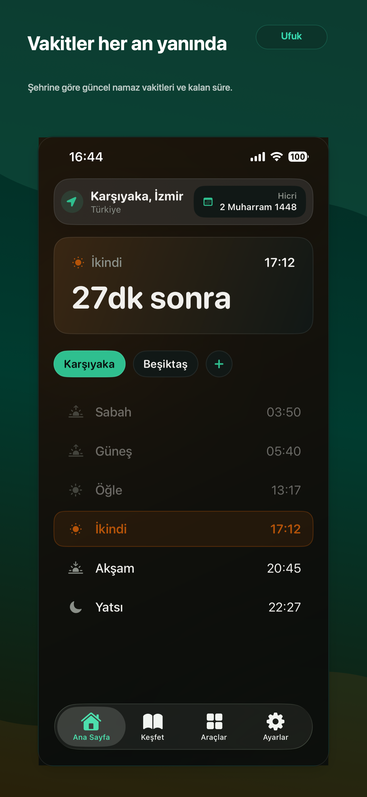
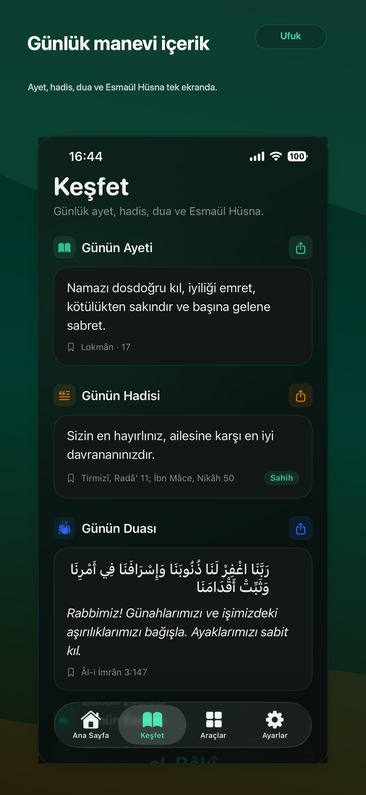
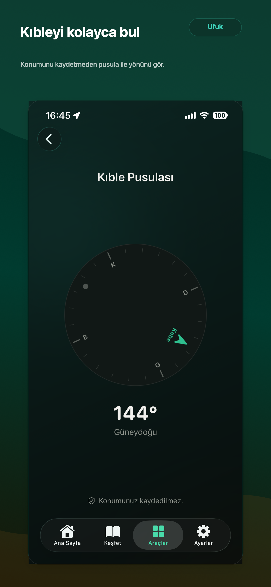
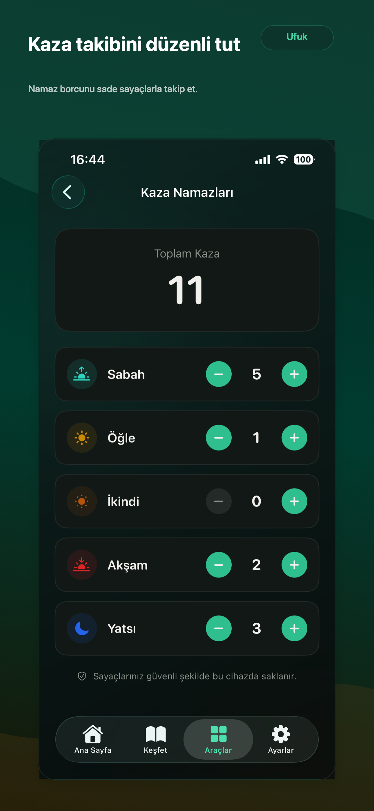
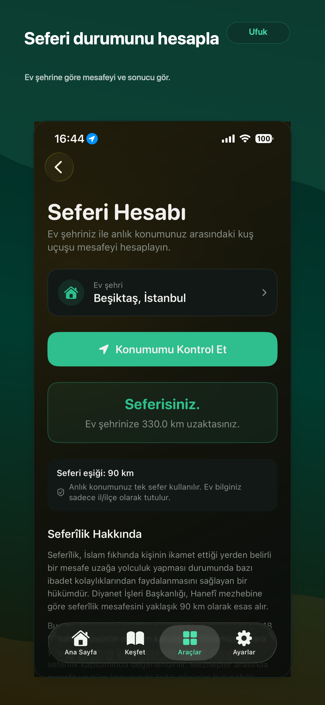

# Ufuk — Namaz Vakitleri

Ufuk, iOS 17 ve üzeri için geliştirilmiş Türkçe ve İngilizce bir namaz vakitleri uygulamasıdır. Vakitleri önce yerel önbellekten, ardından Aladhan API'den alır; ağ erişimi olmadığında Adhan Swift ile cihaz üzerinde hesaplar.

## Güncel durum

- Pazarlama sürümü: `1.0.0`
- Xcode proje build numarası: `6`
- Ana uygulama: `com.vakit.app`
- Widget: `com.vakit.app.widget`
- Minimum iOS sürümü: `17.0`
- Arayüz: SwiftUI, koyu tema, TR/EN lokalizasyon
- Dağıtım hedefi: App Store / TestFlight

## Özellikler

- Seçili konuma göre günlük namaz vakitleri, Hicri tarih ve bir sonraki vakte canlı geri sayım
- Türkiye için yerel il/ilçe verisi, dünya şehirleri ve isteğe bağlı cihaz konumu
- Diyanet, Muslim World League, ISNA, Umm al-Qura ve Egyptian hesaplama yöntemleri
- Standart ve Hanefi ikindi hesabı
- Vakit bazında yerel bildirimler ve bildirim öncesi hatırlatma ayarı
- Kıble pusulası
- Ayet, hadis, dua ve Esmaül Hüsna içerikleri; kare veya hikâye formatında paylaşım görseli
- 30 gün geçmişten 1 yıl ileriye tarih seçilebilir vakit takvimi
- Kategorili ve aranabilir dua kütüphanesi ile cihazda saklanan favoriler
- Cuma günü kartı, isteğe bağlı Cuma hatırlatması ve Ramazan sahur/iftar kartı
- Home Screen widget'ı
- Türkçe ve İngilizce dil desteği
- Sign in with Apple ile isteğe bağlı hesap bağlantısı ve uygulama içinden hesap silme
- RevenueCat üzerinden aylık, yıllık ve ömür boyu Ufuk Pro satın alımları
- Pro kapsamında çoklu şehir, kaza namazı takibi ve seferi mesafesi hesabı

## Ekran görüntüleri

| Vakitler | Keşfet | Kıble |
| --- | --- | --- |
|  |  |  |

| Kaza takibi | Seferi hesabı |
| --- | --- |
|  |  |

## Teknoloji ve mimari

- SwiftUI ve Observation (`@Observable`)
- MVVM: View → ViewModel → Service
- SwiftData: şehirler ve kaza kayıtları
- UserDefaults + App Group: ayarlar, cache ve widget snapshot'ı
- Core Location, UserNotifications, WidgetKit ve AuthenticationServices
- [Adhan Swift](https://github.com/batoulapps/adhan-swift) `1.4.0+`
- [RevenueCat Purchases](https://github.com/RevenueCat/purchases-ios) `5.0.0+`
- [Aladhan API](https://aladhan.com/prayer-times-api) ve çevrimdışı Adhan fallback'i

Vakit çözümleme sırası:

```text
yerel cache → Aladhan API → Adhan Swift → uç durumlar için yaklaşık değer
```

Günlük içerikler uygulama paketinde bulunur. Uygulama açılışında `content/content-version.json` kontrol edilir; daha yeni içerik varsa GitHub raw üzerinden indirilip cihazda önbelleğe alınır.

## Projeyi çalıştırma

Gereksinimler:

- macOS ve Xcode 15 veya üzeri
- iOS 17+ simülatör ya da cihaz
- Satın alma akışını test etmek için RevenueCat public SDK anahtarı

Kurulum:

```bash
git clone git@github.com:fatihdisci/namaz-swiftui.git
cd namaz-swiftui
cp Config/Secrets.xcconfig.example Config/Secrets.xcconfig
open Vakit.xcodeproj
```

`Config/Secrets.xcconfig` içindeki değeri kendi RevenueCat public SDK anahtarınızla değiştirin:

```xcconfig
REVENUECAT_API_KEY = your_api_key_here
```

Anahtar olmadan uygulamanın ücretsiz özellikleri çalışır; ürünler ve Pro erişimi yüklenmez. `Config/Secrets.xcconfig` git tarafından takip edilmez.

Komut satırından simülatör build'i:

```bash
xcodebuild \
  -project Vakit.xcodeproj \
  -scheme Vakit \
  -configuration Debug \
  -destination 'generic/platform=iOS Simulator' \
  CODE_SIGNING_ALLOWED=NO \
  build
```

## RevenueCat yapılandırması

- Entitlement: `pro`
- Ürünler: `vakit_pro_monthly`, `vakit_pro_yearly`, `vakit_pro_lifetime`

App Store Connect ürünleri aynı kimliklerle oluşturulmalı ve RevenueCat'teki `pro` entitlement'ına bağlanmalıdır.

## İçerik güncelleme

`content/` altındaki JSON dosyalarını değiştirdikten sonra `content/content-version.json` içindeki sürümü artırın. Uygulama yeni sürümü algılayarak ayet, hadis, dua ve Esmaül Hüsna dosyalarını indirir; ağ hatasında paket içeriğini kullanmaya devam eder.

## App Store materyalleri

- Türkçe metadata: [`AppStore/Metadata-tr.md`](AppStore/Metadata-tr.md)
- TestFlight yükleme notları: [`UPLOAD.md`](UPLOAD.md)
- Türkçe ekran görüntüleri: `AppStore/Screenshots-tr/`
- Görsel üretim aracı: `scripts/make_appstore_screenshots.swift`

Ekran görüntüsü aracı macOS AppKit kullanır ve kaynak ekran görüntüsü yolları script içinde tanımlıdır. Yeni görseller üretmeden önce bu yolları kendi dosyalarınıza göre güncelleyin, ardından:

```bash
swift scripts/make_appstore_screenshots.swift
```

## Dizin yapısı

```text
Vakit/                 Ana iOS uygulaması
  Models/              SwiftData ve domain modelleri
  Services/            Vakit, konum, bildirim, satın alma ve depolama servisleri
  ViewModels/          Ekran durumları ve iş akışları
  Views/               SwiftUI ekranları
  Resources/           Lokalizasyon, şehir ve içerik verileri
UfukWidget/             Home Screen widget extension
Shared/                 Uygulama ve widget ortak modelleri
content/                Uzaktan güncellenebilen günlük içerik
AppStore/               Mağaza metadata ve ekran görüntüleri
landing/                Destek, gizlilik ve kullanım koşulları sayfaları
scripts/                Yardımcı üretim scriptleri
```

## Gizlilik

Konum; vakit, kıble ve seferi hesaplarında kullanılır. Bildirimler cihaz üzerinde planlanır. Şehirler, ayarlar ve kaza sayaçları cihazda tutulur. Ayrıntılar için [`Vakit/PrivacyInfo.xcprivacy`](Vakit/PrivacyInfo.xcprivacy) ve [`landing/gizlilik-politikasi.html`](landing/gizlilik-politikasi.html) dosyalarına bakın.
